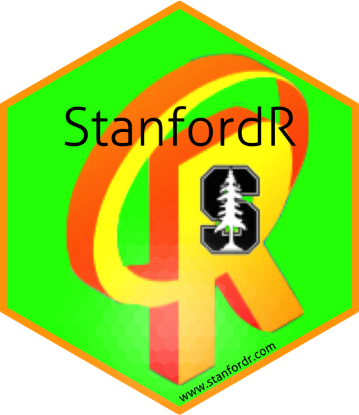

Welcome to the Stanford R Group!  Along with our friends at [r.stanford.edu](http://library.stanford.edu/projects/r), our mission is to serve as the central nervous system of the R programming language community at Stanford University.  We consistently invite the best speakers in the world to come give talks to the Stanford community and work hard to promote and share the latest experiences, tips, and new technologies on all things R.  Taken together, we are a group of R programming language enthusiasts interested in R software development -- if you develop software in R (or want to!), please join us for our upcoming events.

