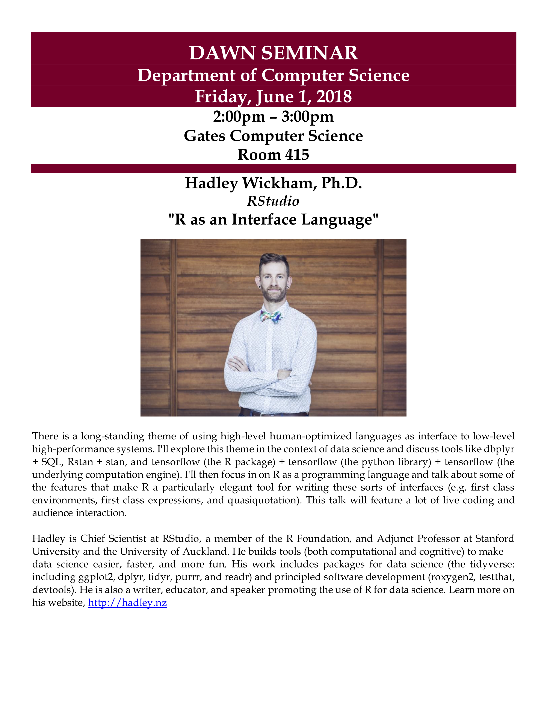
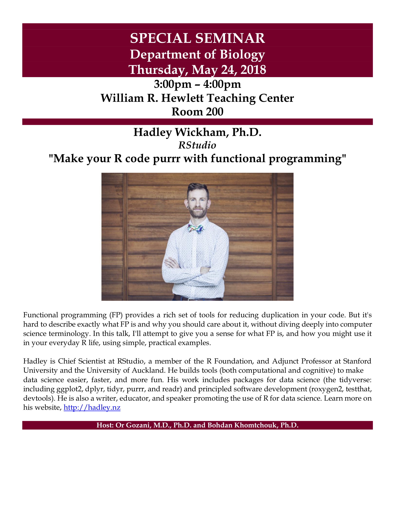
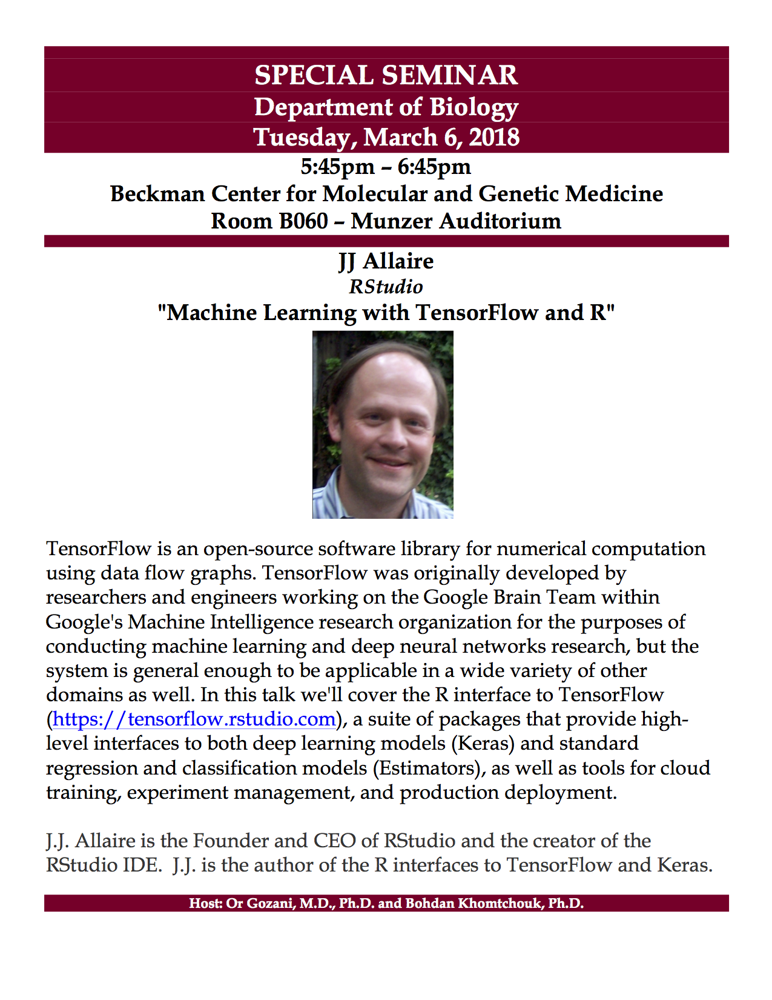
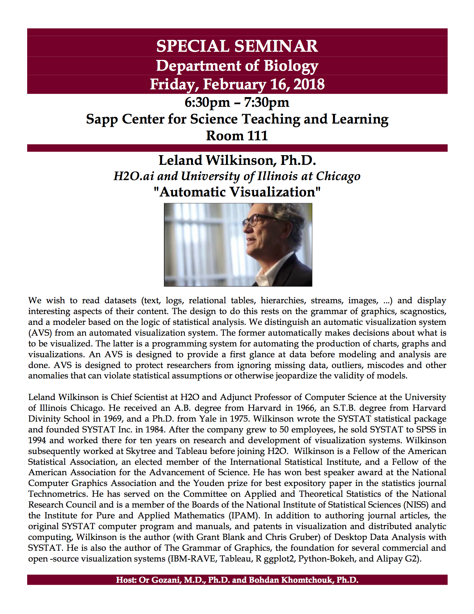
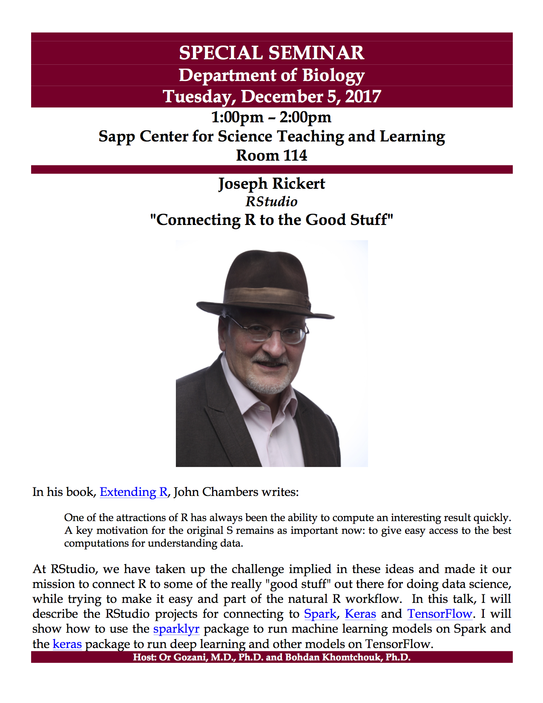
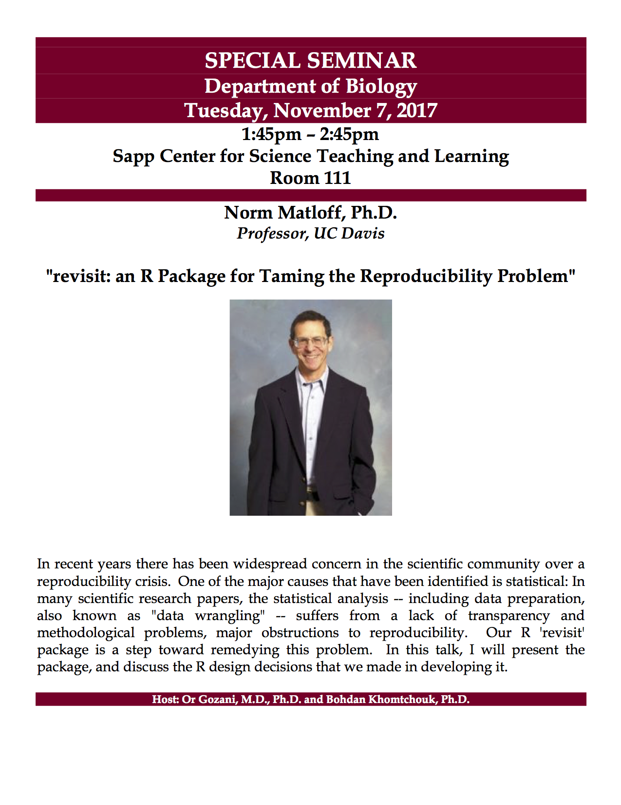

Link to Hadley Wickham's slides coming soon!  Hadley is Chief Scientist at RStudio, a member of the R Foundation, and Adjunct Professor at Stanford University and the University of Auckland.
{ width=65% }

Link to Hadley Wickham's slides coming soon!  Hadley is Chief Scientist at RStudio, a member of the R Foundation, and Adjunct Professor at Stanford University and the University of Auckland.
{ width=65% }

[Link to JJ Allaire's slides](https://rstd.io/ml-with-tensorflow-and-r/).  JJ is the Founder and CEO of RStudio and the author of the RStudio IDE.
{ width=65% }
  
Link to Lee Wilkinson's slides coming soon!  Lee is perhaps most well-known as the father of the Grammar of Graphics.
{ width=65% }

[Link to Joe Rickert's slides](https://github.com/joseph-rickert/Stanford_Talk_12-5-17).  Joe is the R Community Ambassador.
{ width=65% }

[Link to Norm Matloff's slides](http://heather.cs.ucdavis.edu/StanfordR.pdf).  Norm is professor of computer science at the University of California at Davis and author of the books "The Art of R Programming" and "Statistical Regression and Classification: From Linear Models to Machine Learning".
{ width=65% }